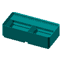

This repository contains STL files for Gridfinity UltraLight bins. These bins are designed to be lightweight and modular, making them ideal for organizing your workspace. Below, you will find a categorized list of available bins, along with their respective images and download links.
## Bins 6 heigh

| Size | Image                                | 1x                                                                                                                                                               | 2x                                                                                                           | 3x                                                                                                           | 4x                                                                                                           | 5x                                                                                                           | 6x                                                                                                           | 7x                                                                                                           | 8x                                                                                                           | 9x                                                                                                           | 10x                                                                                                            |
|------|--------------------------------------|------------------------------------------------------------------------------------------------------------------------------------------------------------------|--------------------------------------------------------------------------------------------------------------|--------------------------------------------------------------------------------------------------------------|--------------------------------------------------------------------------------------------------------------|--------------------------------------------------------------------------------------------------------------|--------------------------------------------------------------------------------------------------------------|--------------------------------------------------------------------------------------------------------------|--------------------------------------------------------------------------------------------------------------|--------------------------------------------------------------------------------------------------------------|----------------------------------------------------------------------------------------------------------------|
| 1    |  | [1x1x6_noscoop](https://zergie.github.io/gridfinity-UltraLight/STLs/1x1x6_noscoop.stl) [1x1x6](https://zergie.github.io/gridfinity-UltraLight/STLs/1x1x6.stl) | 19,5 mm  |                                                                                                              |                                                                                                              |                                                                                                              |                                                                                                              |                                                                                                              |                                                                                                              |                                                                                                              |                                                                                                                |
| 2    |  | [2x1x6_noscoop](https://zergie.github.io/gridfinity-UltraLight/STLs/2x1x6_noscoop.stl) [2x1x6](https://zergie.github.io/gridfinity-UltraLight/STLs/2x1x6.stl) | 40,5 mm  | 26,7 mm  | 19,8 mm  |                                                                                                              |                                                                                                              |                                                                                                              |                                                                                                              |                                                                                                              |                                                                                                                |
| 3    |  | [3x1x6_noscoop](https://zergie.github.io/gridfinity-UltraLight/STLs/3x1x6_noscoop.stl) [3x1x6](https://zergie.github.io/gridfinity-UltraLight/STLs/3x1x6.stl) | 61,5 mm  | 40,7 mm  | 30,3 mm  | 24,0 mm  | 19,8 mm  |                                                                                                              |                                                                                                              |                                                                                                              |                                                                                                                |
| 4    |  | [4x1x6_noscoop](https://zergie.github.io/gridfinity-UltraLight/STLs/4x1x6_noscoop.stl) [4x1x6](https://zergie.github.io/gridfinity-UltraLight/STLs/4x1x6.stl) | 82,5 mm  | 54,7 mm  | 40,8 mm  | 32,4 mm  | 26,8 mm  | 22,9 mm  |                                                                                                              |                                                                                                              |                                                                                                                |
| 5    |  | [5x1x6_noscoop](https://zergie.github.io/gridfinity-UltraLight/STLs/5x1x6_noscoop.stl) [5x1x6](https://zergie.github.io/gridfinity-UltraLight/STLs/5x1x6.stl) | 103,5 mm | 68,7 mm  | 51,3 mm  | 40,8 mm  | 33,8 mm  | 28,9 mm  | 25,1 mm  | 22,2 mm  | 19,9 mm  |
| 6    |  | [6x1x6_noscoop](https://zergie.github.io/gridfinity-UltraLight/STLs/6x1x6_noscoop.stl) [6x1x6](https://zergie.github.io/gridfinity-UltraLight/STLs/6x1x6.stl) | 124,5 mm | 82,7 mm  | 61,8 mm  | 49,2 mm  | 40,8 mm  | 34,9 mm  | 30,4 mm  | 26,9 mm  | 24,1 mm  |

## Bins 3 heigh

| Size | Image                                | 1x                                                                                                                                                               | 2x                                                                                                           | 3x                                                                                                           | 4x                                                                                                           | 5x                                                                                                           | 6x                                                                                                           | 7x                                                                                                           | 8x                                                                                                           | 9x                                                                                                           | 10x                                                                                                            |
|------|--------------------------------------|------------------------------------------------------------------------------------------------------------------------------------------------------------------|--------------------------------------------------------------------------------------------------------------|--------------------------------------------------------------------------------------------------------------|--------------------------------------------------------------------------------------------------------------|--------------------------------------------------------------------------------------------------------------|--------------------------------------------------------------------------------------------------------------|--------------------------------------------------------------------------------------------------------------|--------------------------------------------------------------------------------------------------------------|--------------------------------------------------------------------------------------------------------------|----------------------------------------------------------------------------------------------------------------|
| 1    |  | [1x1x3_noscoop](https://zergie.github.io/gridfinity-UltraLight/STLs/1x1x3_noscoop.stl) [1x1x3](https://zergie.github.io/gridfinity-UltraLight/STLs/1x1x3.stl) | 19,5 mm  |                                                                                                              |                                                                                                              |                                                                                                              |                                                                                                              |                                                                                                              |                                                                                                              |                                                                                                              |                                                                                                                |
| 2    |  | [2x1x3_noscoop](https://zergie.github.io/gridfinity-UltraLight/STLs/2x1x3_noscoop.stl) [2x1x3](https://zergie.github.io/gridfinity-UltraLight/STLs/2x1x3.stl) | 40,5 mm  | 26,7 mm  | 19,8 mm  |                                                                                                              |                                                                                                              |                                                                                                              |                                                                                                              |                                                                                                              |                                                                                                                |
| 3    |  | [3x1x3_noscoop](https://zergie.github.io/gridfinity-UltraLight/STLs/3x1x3_noscoop.stl) [3x1x3](https://zergie.github.io/gridfinity-UltraLight/STLs/3x1x3.stl) | 61,5 mm  | 40,7 mm  | 30,3 mm  | 24,0 mm  | 19,8 mm  |                                                                                                              |                                                                                                              |                                                                                                              |                                                                                                                |
| 4    |  | [4x1x3_noscoop](https://zergie.github.io/gridfinity-UltraLight/STLs/4x1x3_noscoop.stl) [4x1x3](https://zergie.github.io/gridfinity-UltraLight/STLs/4x1x3.stl) | 82,5 mm  | 54,7 mm  | 40,8 mm  | 32,4 mm  | 26,8 mm  | 22,9 mm  |                                                                                                              |                                                                                                              |                                                                                                                |
| 5    |  | [5x1x3_noscoop](https://zergie.github.io/gridfinity-UltraLight/STLs/5x1x3_noscoop.stl) [5x1x3](https://zergie.github.io/gridfinity-UltraLight/STLs/5x1x3.stl) | 103,5 mm | 68,7 mm  | 51,3 mm  | 40,8 mm  | 33,8 mm  | 28,9 mm  | 25,1 mm  | 22,2 mm  | 19,9 mm  |
| 6    |  | [6x1x3_noscoop](https://zergie.github.io/gridfinity-UltraLight/STLs/6x1x3_noscoop.stl) [6x1x3](https://zergie.github.io/gridfinity-UltraLight/STLs/6x1x3.stl) | 124,5 mm | 82,7 mm  | 61,8 mm  | 49,2 mm  | 40,8 mm  | 34,9 mm  | 30,4 mm  | 26,9 mm  | 24,1 mm  |

